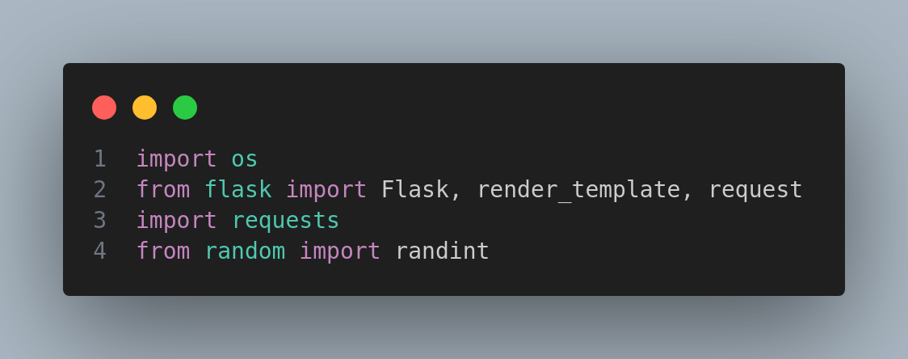

# image-downloader-with-python-flask
Hello, we tried to create a program to **download photos** from the Internet! The result is that you can see, I will give explanations about this experimental project, you can use this project easily and even download paid photos easily using the photo link. **Download it with the highest quality**, let me explain more about this project, **this is smart industries**, let's go!

## We start with the help of these libraries

let's go!

1. os
2. Flask
3. requests
4. rendom

### 1. OS Librarie
With the **OS** library, we help to redirect the image file to the **downloads folder** to save it in our **system downloads folder**, this is the default library in python, you can easily use it, just use it like this Enter:
----------------------------------------------------------------------
`import os`
----------------------------------------------------------------------

### 1. Flask
You probably know!, maybe you don't know, I really don't know, but this is a web project made with Flask micro framework, in this project, with the help of Flask, we get the URL of the image from the front-end, so easily.

#### Install Flask
Install Flask with this command in the command line:

`pip install Flask`

